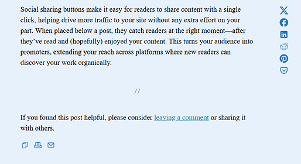
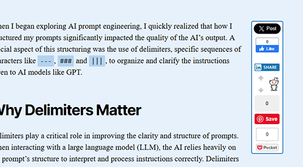
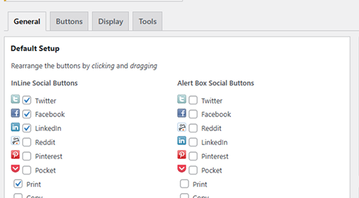
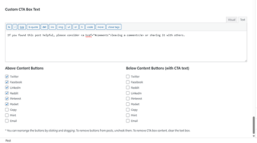

# Socialize — WordPress Social Sharing Plugin

Socialize is a lightweight, flexible WordPress plugin for adding customizable social sharing buttons and call-to-action boxes to your posts and pages. Built with performance in mind, Socialize avoids third-party bloat while offering smart defaults, clean SVG alternatives, and full per-post control over which buttons appear and where.

---

## 🔍 Overview

- Display sharing buttons inline, floating, or in a post-footer CTA box  
- Per-post control over button visibility and order  
- SVG icons or official share buttons for modern performance and style  
- Built-in call-to-action box with custom text and layout options  
- Developer-friendly with filters and extensibility baked in

---

## ✨ Features

- Support for Twitter (X), Facebook, LinkedIn, Reddit, Pinterest, Pocket, Email, Print, and Copy-to-Clipboard
- Inline buttons (above post), floating buttons (side of post), and CTA box (below post)
- Per-post and global configuration
- Custom post type support
- Button alignment (left, right, center) and drag-and-drop sorting
- Optional use of official share buttons
- Lightweight SVG-based icons for improved performance
- Built-in CTA message box with editable text
- Developer API for adding custom services via filters
- Zero third-party tracking unless you enable it

---

## 🖼️ Screenshots

1. **SVG Buttons Preview**  
   
2. **Official Button Integration**  
   
3. **Drag and Drop Button Sorting**  
   
4. **Post Editor Controls & CTA Box Options**  
   

---

## 🚀 Getting Started

### Installation (via GitHub)

1. Download this repository as a ZIP and upload it to `/wp-content/plugins/`
2. Activate it via **Plugins > Installed Plugins**
3. Visit **Settings → Socialize** to configure global button settings and CTA options
4. Use the Socialize panel in individual posts/pages to override defaults

### Installation (via WordPress.org)

1. Install “Socialize” from the Plugins Directory
2. Follow steps 2–4 above

---

## 🧠 How It Works

Socialize inserts sharing buttons either:

- **Inline** (above your post content)
- **Floating** (fixed to the left or right of content)
- **CTA Box** (customizable section below content)

Each location can display different buttons. All display logic is controlled by global defaults, which you can override per post.

You can also disable sharing or CTA sections entirely for any individual post.

---

## 🛠 Developer API

See the [full API reference](https://jonbishop.com/downloads/wordpress-plugins/socialize/socialize-api/) for how to add custom sharing services and extend plugin behavior with filters.

---

## 🙋 FAQ

### Can I disable the CTA box on some posts?

Yes. Use the checkbox in the post editor's Socialize panel.

### How do I change the appearance of buttons?

Use the plugin settings to modify alignment, spacing, icon type, and size.

### Will this slow down my site?

No—SVG icons are local and load instantly. Only official buttons load remote scripts, and only if you enable them.

### Can I change the CTA message per post?

Yes, override the global message in the Socialize post editor panel.

---

## 🔄 Plugin History

Originally launched over a decade ago, Socialize has been part of thousands of sites and remains active today thanks to its simplicity and thoughtful control. Version 3.0 brings a modernized frontend, cleaner settings, and fresh documentation.

---

## 📦 Related Plugins

If you're running a content-heavy WordPress site, you may also like:

- [WP About Author](https://wordpress.org/plugins/wp-about-author/) – Add an author box with bio and avatar below posts  
- [Post Admin Word Count](https://wordpress.org/plugins/post-admin-word-count/) – Track word count in the WordPress admin columns

---

## 🧭 Learn More

- [Official Plugin Page](https://wordpress.org/plugins/socialize/)  
- [Socialize on My Website](https://jonbishop.com/downloads/wordpress-plugins/socialize/)  
- [Other WordPress Plugins](https://jonbishop.com/downloads/wordpress-plugins/)  
- [AI Experiments](https://jonbishop.com/experiments/)

---

## ☕ Support

If Socialize helps you, consider supporting the project:  
[https://jonbishop.com/donate/](https://jonbishop.com/donate/)
